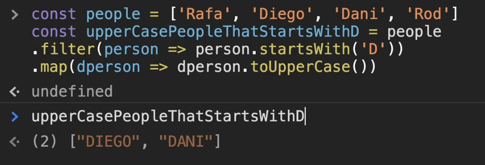

# Programação Funcional
### Por que estudar?
- Organiza uma  linha de raciocínio
- Entender uma nova maneira de aboradar os problemas
- Algumas tecnologias tem como requisito esse conceito

### O que é?

É um paradigma como a Orientação a Objetos por exemplo (uma maneira de resolver problemas)

## Funções
- Pequenas tarefas dentro de uma função
- Abstrai um problema e isolar ele dentra da função
- Não modificar os dados fora dela 
- Pequenas e bem específicas no que fazem

### Principais características da função
- Um dado (ou mais) entra em uma função e um novo dado sai dessa função
- Não altera dados
- Não guarda estado     

        stateless

# Princípios (resumo)

## Paradigmas
* Programação Imperativa
* Programação Declarativa

## Dados
* Imutabilidade
* Stateless

## Funções
* Independentes
* Puras
* Higher-order function
* First-class function
* Composição (composition) 
   
# Detalhamento

<section>

## Imperativo
Faça da seguinte forma

</section>
<section>

## Declarativa
O que fazer, não como fazer (se quiser fazer, a função ta ai, use o valor que quiser)
</section>

   

## Imutabilidade
O conceito de que uma variável não vai variar, se você precisar mudar uma variável, você não vai mudar, você vai criar uma nova

   

## Stateless
Não guarda o estado. A função só conhece dados que foram entregues a ela e sua resposta não poderá variar. (Não guarda dados, depende de dados externos)

   

# Detalhamento das Funções
## Funções independentes
- Presisa ter ao menos 1 argumento (sem dados externos)
- Deverá retornar algo
- Nada que acontecer dentro da função afeta o mundo externo
    - dados imutáveis 
    - stateless
- Não faremos uso de loops (for, while), mas se precisar de tal, usamos recursão (a função chama ela mesma)

   

## Funções puras
Elas não devem depender de nenhum dado externo, a não ser o que foi passado como argumento. Também não deverá sofrer nenhuma interferência do mundo externo a ela. Se o argumento é o mesmo, o retorno não poderá ser diferente quando a função for chamada novamente. 
        
- Além disso, não terá nenhum efeito colateral no seu código
    - Não irá modificar nenhum dado 
    - Não irá guardar nenhum estado

   

## First-class function
- Podem estar em qualquer lugar, inclusive, como parâmetro de outras funções
- A função poderá ser entendida como variável

   

## Higher-order function
- Funções que rebem funções como argumentos
- Funções que poderão retornar outras funções

   

## Composição de funções
- Um encadiamento de funções
- Uma função que retorna um dado e vai para outra função, que retorna um dado e vai pra outra função, que retorna...

   