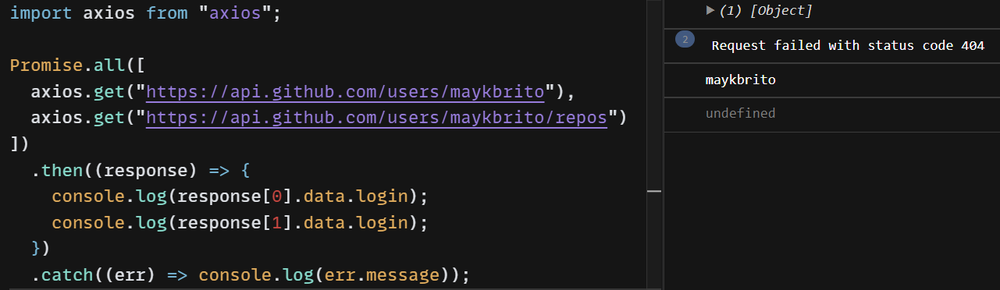

# Javascript Assíncrono

## Síncrono vs Assíncrono

### Síncrono
Sistema síncrono (synchronous), uma tarefa é concluída após a outra. Uma tarefa depende de sua anterior completar para iniciar a próxima

### Assíncrono 
Sistema assíncrono (asynchronous), tarefas são executadas de maneira independente uma da outra. 

## Callback
É uma função que é passada como argumento para outra função e depois de algum certo tempo ela é chamada de volta (callback).

  
Outro exemplo que podemos observar abaixo é que o log "concectando API" aparece antes da resposta do https.get().
Isso se deve ao assíncronismo, onde não depende da resposta do .get() para seguir o código.

  

## setTimeout(function, delay)
Executa uma função após um delay em ms. No exemplo abaixo, irá aparecer no console "Hello World" após 1s:

    setTimeout(() => console.log('Hello World'), 1000)
    
 

# Promise
É uma ação que fica prometida, enquanto tiver esperando você ficaria pendente [pending], caso de certo [fulfilled], case dê errado [rejected]. 

- É um objeto JavaScript com a promessa que algo será realizado
- É usado cpara operações assíncronas
    - Carregar um arquivo
    - Leitura de dados de uma API

### Estágios da Promise
- <strong>Pending:</strong> Estado inicial, assim que o Objeto da promessa é iniciado
- <strong>Fulfilled:</strong> A promessa foi concluída com sucesso
- <strong>Rejected:</strong> A promessa foi rejeitada
- <strong>Settled:</strong> Seja com sucesso ou com erro, ela foi finalmente</strong> concluída

  

## Fetch with Promise
Na imagem que será apresentada abaixo foi utilizado o comando fetch() para buscar dados de uma API, depois houve um encadeamento de .then(), para que cada linha atribuísse algo, virando em cada linha uma nova Promise, gerando assim um encadeamento de Promises. Citando cada um:
- Quando recebido as datas, transformaram em arquivo .json
- Caso seja transformado com sucesso, buscar um dado específico do objeto JSON
- Caso tenha pego com sucesso o dado específico, transformar o dado em objeto JSON
- Caso seja transformado com sucesso, exibir no console.log()
- Caso tenha algum erro, exibiro no console o erro com o .catch()

  

## Promise all
Pordemos também rodar mais de uma promessa ao mesmo tempo, utilizando o comando Promise.all() e botar como argumento um array de promessas. Para usar o .then(), utilizamos como resposta a posição da promessa no array, assim como o exemplo abaixo:

  

## Axios
Para facilitar, podemos utilizar a biblioteca Axios. Ela já existe nos navegadores mas precisa da instalação para utilização no Node. Ele facilita o processo de promessas.

