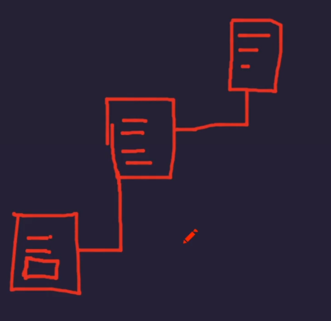
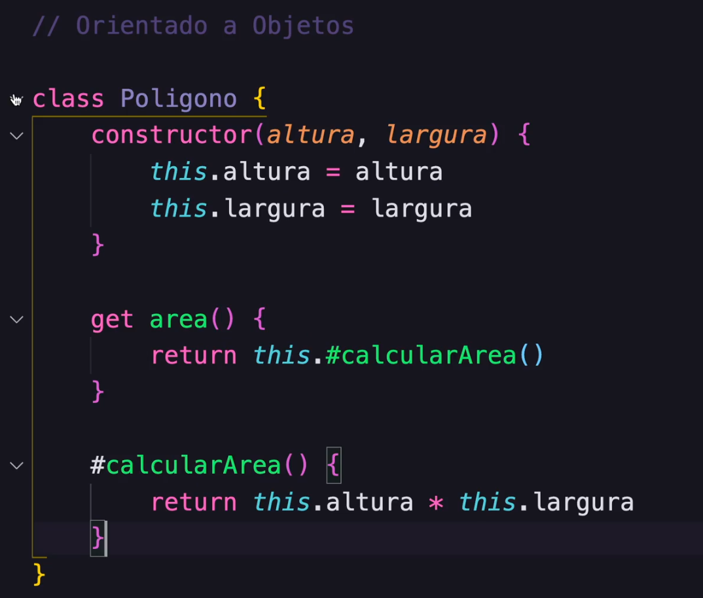
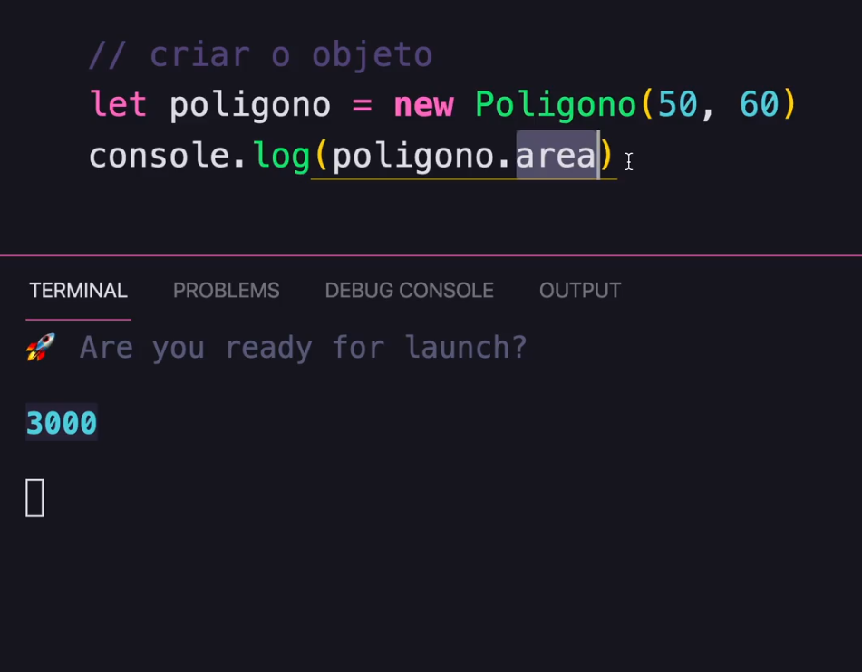
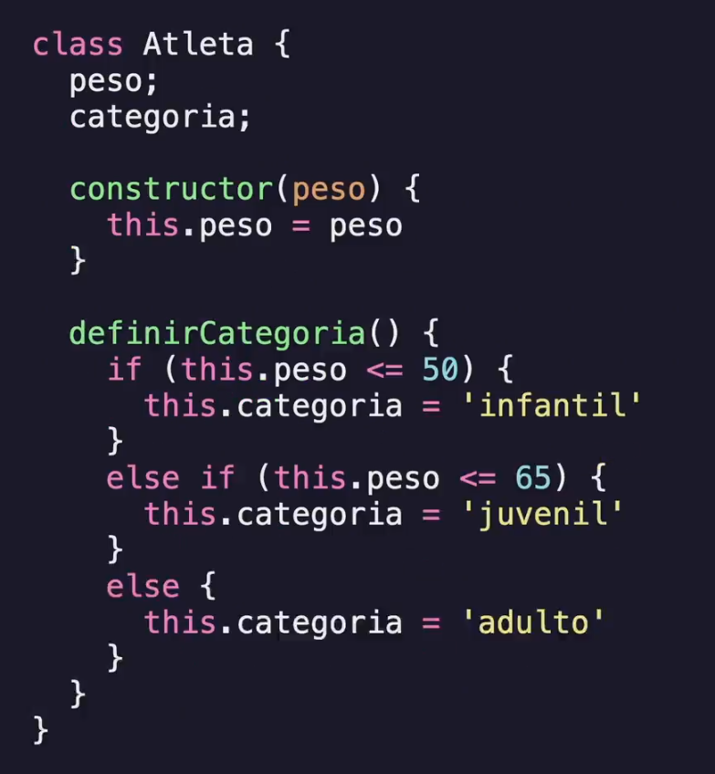
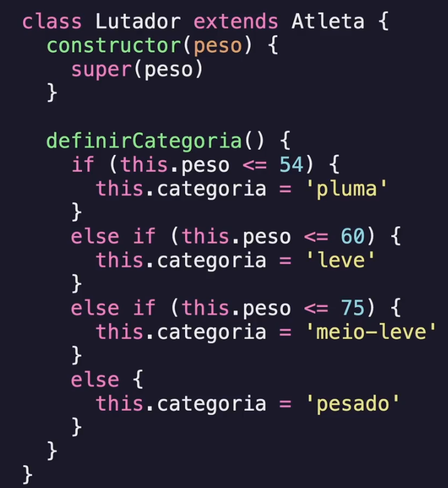
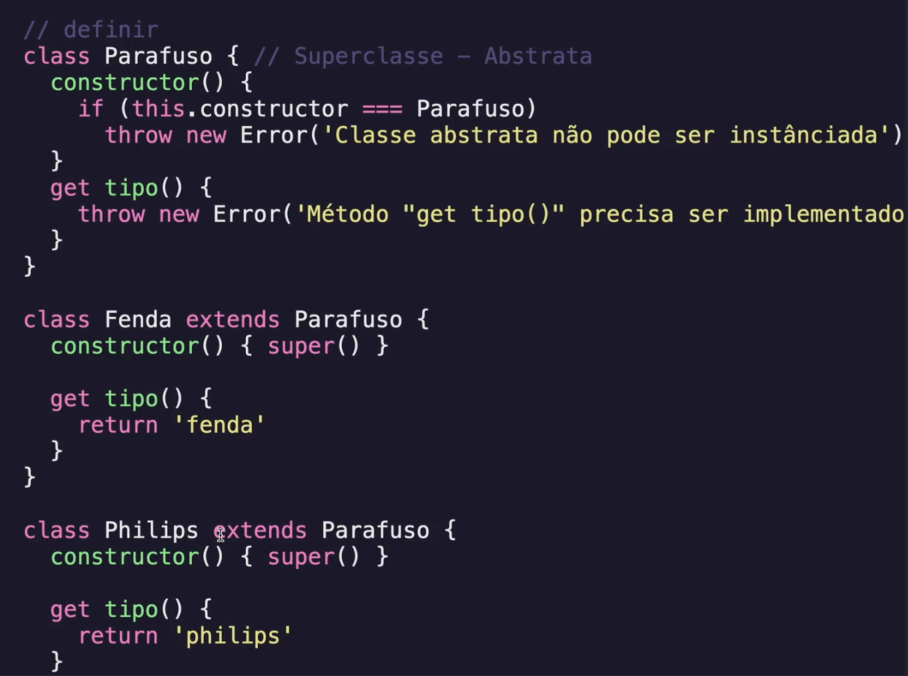
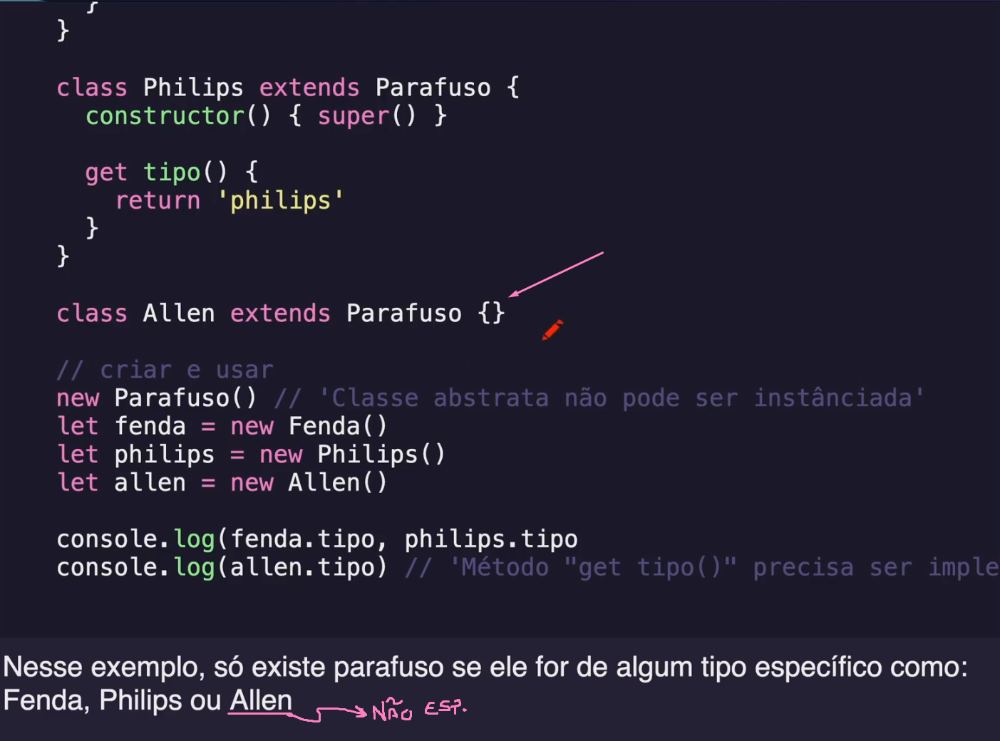
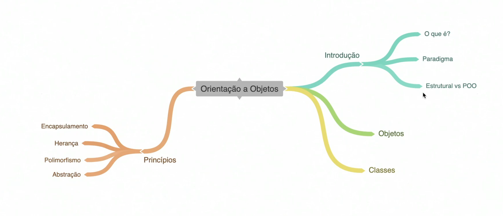

# Programação Estruturada x Orientada a Objetos

## Programação Estruturada
 - Processa a entrada e manipulação dos dados, até a saída
 - Uso de sequências, estruturas de repetições e condições
 - Uso de uma rotina maior, ou sub-rotinas
 - Não existem restrições às variáveis

 ## Programação Orientada a Objetos
 - Surge para trazer um cuidado ao uso estruturado
    - Não elimina por completo o uso estruturado
 - Conceitos como Objetos e Classes
 - Cuidados com variáveis e rotinas (Encapsulamento)
 - Melhor reuso de código (Herança)

# Classes

Funcionam como um molde para os objietos. Os objetos são criados a partir de uma classe e muito deles podem ser feitos da mesma classe

## Classe em JavaScript

- Syntactical sugar
- Prototype

No JavaScript os objetos podem herdar características dos seus "criadores", que podem ser das classes e também do "Prototype", que são características ja pré-estabelecidas para ele. Exemplo: 
   

## Encapsulamento

Agrupamento de funções e variáveis todas colocadas em uma classe. É uma camada de segurança para os atributos e métodos
"Eu posso dirigir um carro sem saber como o motor dele funciona"   
     

## Herança 
Os objetos herdam características bases dos seus pais (uma copia de atributos e métodos de outras classes)
 

## Polimorfismo
Quando um objeto estende de outro (Herança) talvez haja a necessidade de reescrever uma ou mais características (atributos e métodos) nesse novo objeto.
Recriaremos então um método (ou mais) da classe herdada. Polimorfismo significa "muitas formas".    
    

## Abstação
Template ou Identidade de uma classe que será construída no futuro.

- Atributos e métodos podem ser criados na classe de Abstração (Superclasse) 
    - CONTUDO, a implementação dos métodos e atributos, só poderá ser feita na classe que irá herdar essa Abstração

  
        

# Conclusão

